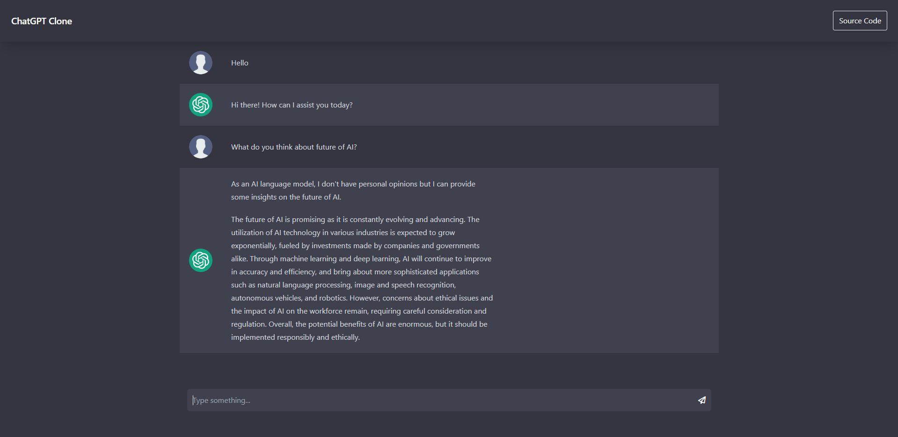

## Open AI ChatGPT Chat Page Clone

Fun project to get much familiar with TailwindCSS and still be able to use ChatGPT bot when it is at full capasity 👹

It's looks like;



Happy chating 🤟🏻

## Installation

```bash
## Clone the repository to your local
git clone https://github.com/yagizhanNY/openai-chatgpt3-clone.git

## Navigate to project's directory
cd openai-chatgpt3-clone

## Install the packages
npm install

## Run the app
npm run start
```

After these steps you have to create an OpenAI account to create an API. You can create an account from [this link](https://openai.com/api/). Then you have to create an API key. Then press the `OpenAI API Key` button on the sidebar and paste your api key to the dialog and press `Submit` button.

You can try the [DEMO](https://chatgpt-clone-yny.web.app/) with your own API key.

## Supported Features

- Historical chat.
- Save the chat history.
- Full capacity of **gpt-3.5-turbo**.
